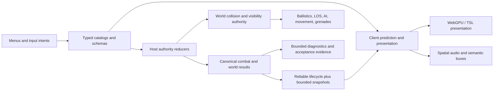
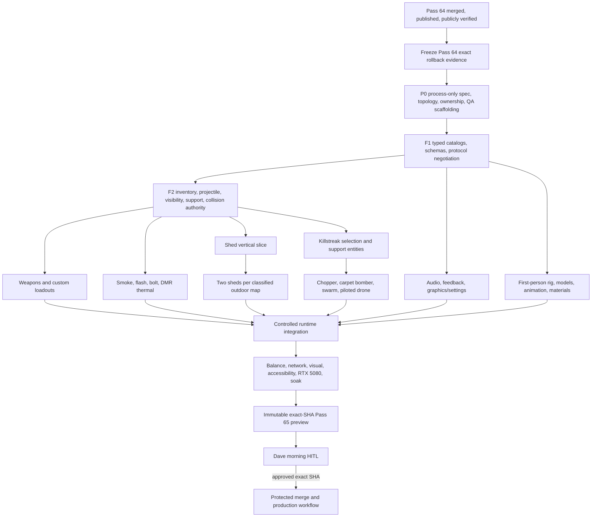

# Atomic Acres Pass 65 — “The Big One” Master Delivery Plan

Prepared: 2026-07-25 (Europe/London)
Plan owner: Codex release integrator
Target project: `daveinturkey15-byte/atomic-acres-browser-arena`
Publication rule: **Pass 65 must stop at an immutable preview for Dave’s explicit HITL approval. It must not publish before that approval.**

## 0. Executive decision

Pass 65 will be treated as one numbered product release assembled through staged, reviewable integration waves. It will not be treated as one giant commit, a cosmetic reskin, or a set of unrelated experiments.

The first hard gate is external to Pass 65:

- Pass 64 must be merged, deployed, and independently verified at the public chooser and live channel.
- Its exact production source SHA, workflow run, Pages SHA, deployed subtree identity, and public behaviour must be recorded.
- After Pass 64 is live, its exact published bytes are frozen as the future Pass 65 rollback. The public stable route remains Pass 63 throughout Pass 65 development and changes to those frozen Pass 64 bytes only during an approved Pass 65 promotion. The Pass 62 best-netcode benchmark remains an immutable, independently verified oracle under an explicit public-route or offline-reconstruction policy.
- Only after that evidence exists may any Pass 65 branch or worktree be created from the exact new `origin/main`.

That gate was independently satisfied at 2026-07-25 22:35 BST:

- Final released Pass 64 main and Pass 65 `B0` are `5075a52d80c6db69a97ed53acc2df5368728371a`.
- Exact-main verification run `30175101338`, protected production run `30175191044`, and Pages run `30175279180` all succeeded; the resulting Pages SHA is `8326c95659a9fb8c5979c13f9b88126c4ffb85f7`.
- Production receipt artifact `8624038234` binds those identities to a captured Pass 64 topology pointer: channel `channels/experimental-netcode-pass`, `exactRootFileCount=130`, and `treeSha256=ffd3e130d005e9321976795fe2d5cadfd9965ebb27dc0bbff0c1609816cff20b`. This is not yet the complete rollback record; B1 task F00 must materialize its schema, digest scope/exclusions, verifier, and protected no-rebuild restoration policy.
- A cache-busted chooser rendered Pass 64 Live / Pass 63 Stable; direct Pass 64 entered bot gameplay; fresh stable, normal, and room routes loaded with no unexpected browser logs.
- The isolated P0 worktree was then created from exact `B0`; runtime work still waits for post-P0 `B1`.

Historical preparation snapshot, superseded by the evidence above: at 21:05 BST the chooser still showed Pass 63 Live / Pass 62 Stable and Pass 64 had not deployed. That observation explains why early requirements and architecture work stayed off-repo; it is not current release truth.

## 1. Scope reality and delivery stance

The requested scope combines several normally separate releases:

1. A modern WebGPU graphics/effects and combat-feedback pass.
2. A first-person rig, hands, weapon art, animation, sound, and effects overhaul.
3. A major arsenal and custom-loadout expansion.
4. New smoke, flash, and explosive-projectile gameplay.
5. A versioned graphics/audio settings product surface.
6. Map ambience and continued arena-structure cleanup.
7. A polished map-preview showpiece: living helicopter motion, a sleek cockpit, and joyful Gun Range cat POV choreography.
8. A reusable, networked, physically interactive destruction prototype.
9. A selectable five-slot killstreak system with five complex new support effects and believable host-seeded chopper motion.
10. Multiplayer authority, anti-replay, performance, accessibility, and release evidence for all of the above.

This is not credibly a single-night implementation if “done” means the project’s existing standard: multiplayer-safe, visually reviewed, deterministic where required, hardware-verified, legally sourced, regression-tested, and recoverably released. The audited 122-task model totals 813 active agent-hours P50 and 1,624 P90 before the cross-lane reserve, or about 935/1,949 after the stated 15%/20% reserve. Even impossible perfect four-way utilization bottoms out near 234/488 wall-hours; the first dependency-aware conjecture is roughly 307–575 elapsed active hours plus external waits. `PASS65_ESTIMATION_AND_CRITICAL_PATH.md` carries every task row and must be recalculated from actual telemetry at B1. The B1.0 lifecycle/authority gate, destructible shed, authored viewmodels, preview/cockpit choreography, and aerial support entities dominate risk.

That estimate is not a reason to weaken the pass. It is a reason to structure it correctly:

- Work continuously in bounded waves.
- Keep the integration PR draft and non-promotable until the full requirement matrix is green.
- Allow experimental flags and test scenes during development, but do not call a partial build “Pass 65 complete.”
- Do not silently lower thresholds to manufacture a morning candidate.
- If a morning review build exists, label its exact implemented scope. The final Pass 65 publication gate remains all required outcomes plus explicit HITL.

## 2. Claim ledger

### 2.1 Observed facts

- Pass 64 has an approved immutable preview at source `c30fb9a103aa8051417f2d1d3130f85265ed56aa` and a final released main identity at `5075a52d80c6db69a97ed53acc2df5368728371a`.
- Final verification `30175101338`, production `30175191044`, Pages `30175279180` / `8326c95659a9fb8c5979c13f9b88126c4ffb85f7`, and production receipt artifact `8624038234` agree.
- The public chooser says Pass 64 Live / Pass 63 Stable; direct Pass 64 gameplay and fresh stable/normal/room routes were independently rendered without unexpected logs.
- The Pass 65 P0 worktree is isolated at exact `B0` on `contrib/dave-gaming-pc/codex/pass65-p0`; no runtime worktree exists before B1.
- `src/legacy-main.ts` is 12,438 lines and owns substantial gameplay composition, networking, presentation, settings, grenades, and killstreak wiring.
- The current protocol is version 6 and hard-codes five primary weapons, three sidearms, and one special weapon.
- The current loadout model has four fixed field kits and derives the sidearm from the primary.
- The current grenade message has no grenade-kind identity.
- Current Field Support is a fixed five-entry catalog wired to keys 3–7.
- Current world authority is primarily static; many gameplay consumers read static arena colliders or shot surfaces directly.
- Current first-person presentation reuses four third-party gun GLBs across nine weapon IDs and procedural arms/knife geometry.
- Current footstep emission is local-player-only; no spatial remote/bot footstep system exists.
- Current audio has internal buses but no exposed category mixer, music buses, or continuous per-arena ambience system.
- Local hardware discovery confirms `NVIDIA GeForce RTX 5080`, driver `591.86`, 16,303 MiB reported VRAM; the primary desktop is 2560×1440. Browser WebGPU adapter/backend identity must still be proven at the exact candidate SHA.
- Three.js WebGPURenderer requires TSL/node-material paths for custom shaders; `ShaderMaterial`, `RawShaderMaterial`, and `onBeforeCompile()` are not supported on that route.
- Rapier supports rigid bodies, collision events, impulses, joints, queries, and deterministic execution given identical ordering and initialization. It does not provide general thin-sheet soft-body deformation or arbitrary runtime fracture.

### 2.2 Inferences

- Directly adding all Pass 65 branches to `legacy-main.ts` would make the architecture less maintainable and create uncontrolled integration conflicts.
- Weapon/loadout/grenade expansion is a protocol and authority migration, not a UI-only task.
- Smoke must exist as a semantic visibility volume consumed by players, bots, optics, and support targeting. A particle cloud alone would be false gameplay.
- The DMR thermal optic needs a different occlusion contract from the railgun: bypass smoke, never bypass solid walls.
- Long-lived, targetable choppers/drones/crates need host-owned entity lifecycles, not client-authored hit packets.
- The shed needs a unified dynamic collision/ballistics authority; a moving render-only door over a static collider would be an immediate defect.
- Convincing browser destruction should use authored damage cells and fracture chunks, not unbounded runtime CSG or soft-body simulation.
- Random-feeling aircraft motion must be smooth and reproducible: menu motion can vary by seeded session, while killstreak motion must be host-seeded shared state rather than client-local randomness.

### 2.3 Recommended assumptions pending product confirmation

- Keep the existing four curated kits as the first row; add `Custom 1`, `Custom 2`, `Custom 3`, plus a fourth Manage/Rename tile in the second row. This matches the explicit three names while preserving a four-column UI.
- Each custom preset chooses one primary, one secondary, and one grenade type.
- Interpret Adrenaline as +10% weapon damage, +10% movement speed, and 10% shorter reload duration for 15 seconds, non-stacking. A flat +10 per pellet would catastrophically distort shotgun balance.
- Treat “Chopper Gunner” as an AI-operated attack helicopter unless player-gunner control is explicitly requested.
- Drone Swarm replaces Nuke in the selectable top-tier slot, while Nuke remains a care-package-only 1% jackpot. This reconciles both statements in the request.
- A piloted-drone user’s body remains stationary and vulnerable; body death, drone death, fuel expiry, or ammo exhaustion exits possession cleanly.
- Care packages are single-consume, host-authored objects. Recommended rule: enemies may steal them, with a shorter owner capture time.
- “Any random killstreak” means every shippable non-care-package streak appears exactly once in the weighted reward catalog; only the care package itself is excluded to prevent recursive rewards, and Nuke remains exactly 1%.
- Public default graphics mode is capability-aware High; the verified RTX 5080 profile selects High by default with Max available. Do not force Max or unsafe settings on weaker public devices.
- Use original in-game names and original or clearly licensed art/audio. Familiar real-world labels are archetype references, not permission to copy franchise assets, sounds, code, UI, or branding.
- The eventual approved release names are fixed by Dave: Pass 65 Live is `The Big One`; frozen Pass 64 Stable is `WebGPU Migration`.

### 2.4 Unknowns to freeze before their implementation wave

| Decision | Recommended default | Why it matters |
|---|---|---|
| Does the custom row contain three presets or four? | Three presets + Manage/Rename tile | The request explicitly names only Custom 1/2/3. |
| Grenade carry limits | Two frag; one smoke; one flash initially | Prevents permanent visibility/flash saturation. |
| Friendly smoke/flash | Smoke affects everyone; flash has reduced friendly effect | Needs deterministic team rules. |
| Adrenaline modifiers | ×1.10 damage, ×1.10 movement, ×0.90 reload duration; no stack | Avoids shotgun and modifier-order exploits. |
| Nuke after Drone Swarm | Care-package-only at exactly 1% | Reconciles “Nuke replacement” with requested care-package jackpot. |
| Chopper control | Host-driven AI | User behaviour description is autonomous despite the name. |
| Care-package theft | Enemy-stealable; owner capture advantage | Creates counterplay and clear authority rules. |
| Piloted-drone body | Immobile and vulnerable | Prevents possession from becoming free invulnerability. |
| Outdoor-map classification | Nuke Town and RustRig; explicitly decide Terminal apron | Shed count depends on this registry. |
| RTX 5080 review resolution | 2560×1440 primary; 1600×900 deterministic; optional 4K Max | Exact performance targets require a fixed display contract. |
| Weapon display names | Original equivalents | Avoids confusion with proprietary presentation or endorsement. |

### 2.5 Plan falsifiers

The plan must stop and be revised if any of these occurs:

- Pass 64 cannot be tied to an exact successful production workflow, Pages SHA, receipt, and public rendered identity.
- Any Pass 65 preparation mutates the finalizing Pass 64 worktree.
- Frozen Pass 62 or Pass 64 bytes drift.
- Mixed protocol versions enter gameplay ambiguously.
- A guest can author shared damage, ammo, reward, crate result, drone pose, door state, fracture, flash strength, or score.
- A visual bullet hole still blocks a bullet, or an invisible region permits one through.
- A moving door’s mesh, movement collider, AI LOS, grenade sweep, and ballistic surface disagree.
- The DMR sees through a wall, normal vision sees through smoke, or smoke blocks bullets.
- A reconnect/retry duplicates ammo, projectile detonation, loot, score, or killstreak consumption.
- Any new content ID falls back to a generic/missing model in an approved candidate.
- WebGPU silently falls back or loads a legacy GLSL-only custom path.
- Entity, debris, particle, audio-node, memory, or network caps are exceeded.
- Menu helicopter or cat motion jitters, clips, loops visibly, causes discomfort, loses map composition, or ships a hollow/blocky cockpit.
- Killstreak chopper variance diverges between peers or changes collision, targeting, LOS, cover, lifetime, or calibration outside its frozen tolerance.
- Any final chooser/release surface names Pass 65 Live or Pass 64 Stable differently from `The Big One` / `WebGPU Migration`.
- Any runtime or release-shell byte changes after Dave approves the exact preview.

## 3. Non-negotiable release invariants

### G1 — Pass 64 live gate

No Pass 65 repository branch, worktree, commit, server, build, test, or release mutation begins until Pass 64 is proven live from independent evidence.

### G2 — Dual rollback protection

- Pass 62 remains the immutable best-netcode benchmark under a frozen availability policy.
- Once live, Pass 64 is frozen as the future byte-exact Pass 65 rollback; it does not replace public Pass 63 stable during development.
- Only the approved Pass 65 promotion installs exact frozen Pass 64 bytes as public stable.
- Neither fallback is reconstructed through Pass 65 source code; the restoration path is staged and smoke-tested before HITL.

### G3 — One integration authority

One integrator owns the Pass 65 integration worktree and central ledger. Specialists own separate worktrees and hand off bounded commits plus evidence. Nobody else edits the integration worktree.

### G4 — One runtime integration PR

The current acceptance system requires exact-preview approval for runtime/release-shell PRs. To avoid ten independent HITL approvals and overlapping acceptance manifests:

- Land at most one mechanically `process-only` preparation PR, using an exact changed-path allowlist proven against the current impact classifier.
- Do not call `.agents/skills`, baseline records, package scripts, unclassified QA/release tooling, `release-channels.json`, or release-shell changes process-only unless the classifier is deliberately extended with base/head negative tests.
- Assemble all Pass 65 runtime work in one draft integration PR through reviewed specialist commits.
- Maintain exactly one `acceptance/pass-65.json` for the candidate.
- Preserve stable planning IDs `R###` in the matrix, but generate the executable manifest's schema-required sequential IDs `R1..R99` from exact matrix table order. A Pass 65 mapping verifier must prove the one-to-one order and preserve each planning ID in `planningRequirementId` plus the summary prefix.
- Freeze runtime/release-shell source as `S0`, obtain `pr-preview-<pr>-<S0>`, then add one manifest-only descendant `S0M`. Schema v1 requires `status="accepted"`; S0M uses that literal value, completes every other schema field and every required pre-HITL evidence field, and deliberately omits only `humanAcceptance`, so the generic gate has exactly one expected error until Dave acts. Phase-tagged post-release R04 evidence is never fabricated into S0M.
- Per-requirement S0M evidence must be mechanical, visual, or independently reviewed and complete before Dave acts. Dave's later owner/taste disposition is represented once by global R006/H02 and `humanAcceptance`, never smuggled into a row that S0M claims already verified.
- Do not merge that runtime PR before exact-SHA HITL.

### G5 — Authority and presentation separation

Gameplay authority is profile-independent. Performance, High, Max, and compatibility presentation may differ visually, but movement, collision, hits, visibility semantics, timing, and shared outcomes do not.

### G6 — Original/legal content

No copied Call of Duty/Black Ops assets, audio, code, UI, names-as-branding, or animations. Every shipped asset needs source, licence/provenance, digest, and manifest coverage.

### G7 — Fail closed

Unknown IDs, illegal settings, malformed snapshots, stale life epochs, missing assets, unsupported WebGPU paths, unbounded arrays, and unverifiable release identity fail closed. Tests are not weakened to turn failures green.

### G8 — Explicit morning HITL

“Work until morning” is authorization to prepare/build within scope, not approval to publish. Approval must identify the immutable preview SHA. Any later runtime/release-shell change invalidates it.

## 4. Target architecture

The architecture follows one rule: definitions are pure data, simulation is pure or host-owned, and presentation cannot invent authority.

### 4.1 Domain layers



### 4.2 Proposed module seams

Add focused modules without wholesale-moving every existing file at once:

```text
src/
  combat/
    weapon-schema.ts
    weapon-catalog.ts
    weapon-registry-verifier.ts
    combat-inventory-authority.ts
    combat-result.ts
  loadouts/
    loadout-schema.ts
    loadout-storage.ts
    loadout-selection.ts
  ordnance/
    ordnance-schema.ts
    ordnance-catalog.ts
    projectile-authority.ts
    visibility-volume.ts
    flash-authority.ts
  support/
    killstreak-schema.ts
    killstreak-catalog.ts
    killstreak-loadout.ts
    support-entity-authority.ts
    support-navigation.ts
  interactive-world/
    world-collision-authority.ts
    interactive-world-definition.ts
    destructible-shed-definition.ts
    destructible-shed-authority.ts
    destructible-shed-presentation.ts
  settings/
    graphics-settings.ts
    audio-settings.ts
    accessibility-settings.ts
  audio/
    audio-mixer.ts
    spatial-voice-pool.ts
    arena-audio-definition.ts
  presentation/
    weapon-presentation-definition.ts
    viewmodel-action-graph.ts
    combat-feedback-presenter.ts
```

Existing modules remain adapters until their consumers migrate. `legacy-main.ts` must trend toward composition and wiring; Pass 65 must not add another forest of weapon, grenade, streak, and destruction branches inside it.

### 4.3 Canonical weapon definition

Each weapon has one validated definition covering:

- Stable ID, original display name, family, primary/secondary/special slot.
- Fire type: hitscan, pellet, slug, or projectile.
- Fire mode, RPM, spin-up, burst policy, and trigger semantics.
- Base/minimum damage, falloff start/end, head/limb multipliers.
- Hip/ADS/movement/stance spread and sustained bloom.
- Pitch/yaw recoil, recovery, ADS/crouch/prone modifiers.
- Magazine, reserve, reload phases, switch time.
- Movement multiplier.
- Penetration calibre/power, material behaviour, energy retention, surface cap.
- Optic magnification, thermal and occlusion policy.
- Model, LOD, sockets, semantic parts, animation graph, audio profile, muzzle/ejection/light identities.
- Bot eligibility, pickup/drop policy, loadout eligibility.
- Asset provenance and digest.

Compile-time exhaustiveness and a runtime registry verifier must prove every ID has complete gameplay, protocol, presentation, audio, penetration, loadout, bot, replay, telemetry, test, and provenance coverage.

### 4.4 Loadout v2

`LoadoutPresetV2` contains:

- Stable local preset ID.
- Sanitized local display name.
- Primary weapon ID.
- Secondary weapon ID.
- Grenade ID.
- Schema version.

Rules:

- Migrate existing `atomic-acres.field-kit.v1` without deleting it until migration succeeds.
- Persist only normalized allowlisted values.
- Custom display names never enter multiplayer snapshots.
- Freeze equipment selection at deployment/match boundaries according to existing class-switch policy.
- Reject illegal weapon-slot and grenade combinations.
- Preserve selection across respawn, redeploy, rematch, reload, and storage migration.

### 4.5 Protocol and combat authority

Recommended protocol target: version 7 with a clean mismatch exit.

Add a host-owned, per-player/per-life `CombatInventoryAuthority` tracking:

- Primary, secondary, grenade, equipped weapon.
- Magazine and reserve per weapon.
- Grenade count/type.
- Reload, switch, trigger, minigun spin-up, and projectile action state.
- Life/epoch/action sequence and exactly-once consumption.
- Adrenaline/status modifiers in canonical order.

Clients send bounded intents. The host admits and authors shared outcomes. A client-claimed spin start, ammo count, flash result, bolt attachment, streak reward, or entity pose is never trusted.

Before content expansion, finish the stale-life invariant already identified around target `lifeId` and monotonic `healthRevision`; Pass 65 adds too many delayed/projectile effects to tolerate incoherent life epochs.

### 4.6 Generic projectile/effect model

- Frag, smoke, and flash share a typed grenade lifecycle but different effect reducers.
- The explosive crossbow is a projectile entity, not a disguised grenade.
- Host creates stable projectile/effect IDs and canonical timestamps.
- Lifecycle events are reliable and exactly once.
- Pose updates are bounded and lossy where appropriate.
- Detonation/effect paths are pooled and prewarmed.
- Reconnect/late join reconstructs active smoke, bolts, crates, and support entities from snapshots.

### 4.7 Visibility authority

Smoke creates an authoritative `VisibilityVolume` with stable ID, geometry, density curve, lifetime, revision, and team-neutral semantics.

Consumers:

- Normal player visibility and targeting.
- Bot acquisition and tracking.
- Chopper/drone acquisition.
- DMR thermal policy.
- Spectator/diagnostic overlays.

Rules:

- Bullets pass through smoke.
- Ordinary optics and AI cannot acquire through sufficiently dense smoke.
- The DMR thermal optic may reveal living actors through smoke.
- World depth and authoritative wall geometry always occlude the DMR.
- The piloted drone’s through-wall hostile sensor is a separate explicit capability and never leaks into the DMR.

### 4.8 Killstreak architecture

Replace the fixed internal list with:

- `KillstreakDefinition`: ID, display name, cost, tier, duration, activation mode, targeting mode, entity kind, authority policy, presentation identity.
- `KillstreakLoadoutV1`: exactly five legal persisted slots under the frozen duplication/alternative policy, frozen at match start.
- `SupportActivation`: stable ID, owner/team/life, seed, earned time, activation time, state, consumed revision.
- `SupportEntity`: entity ID, activation ID, owner/team, health, pose, velocity, ammo, reload, fuel/lifetime, target, navigation state.

Every provisional product choice is represented in canonical `docs/PASS65_DECISION_RECEIPTS.json`, validated against `docs/PASS65_DECISION_RECEIPTS.schema.json`. P0 contains 15 complete `OPEN` receipts with proposed defaults, null authoritative values, rationale, owner, recorded timestamp, deadline and supersession field. A dependency such as `P04[DEC-13=FROZEN]` is satisfied only by a validated `FROZEN` receipt with non-null value and resolution timestamp; merely listing or recording a default never unlocks implementation.

Host fixed-step simulation authors navigation, targeting, damage, health, reward, crate roll, loot, and lifecycle. Reliable spawn/despawn/state transitions combine with bounded pose snapshots. Targetable support entities use hit proxies with pose history so ordinary host-authored shots can destroy them under latency.

### 4.9 Dynamic world authority

Create one `WorldCollisionAuthority` snapshot joining:

- Immutable arena geometry.
- Interactive doors.
- Attached/detached shed panels.
- Major debris.
- Current ballistic apertures.
- Temporary presentation-only objects explicitly excluded from authority.

Movement, ballistics, grenades, AI LOS, support targeting, spawn safety, navigation, and minimap must query the same revisioned authority rather than independent static arrays.

## 5. Workstream ownership

The machine permits one root integrator plus at most three active specialists. The release is therefore organized into waves, not a free-for-all.

| Role | Owns | Must not own |
|---|---|---|
| Release integrator / SHA guardian | Central ledger, integration worktree, acceptance manifest, merge order, receipts | Parallel feature implementation in specialist trees |
| Combat schema and balance | Weapon catalog, loadout schema, role/TTK tests | Models, audio assets, release workflow |
| Multiplayer authority | Protocol v7, inventory reducer, stale-life/exactly-once gates | Visual balance or asset taste |
| Weapon/viewmodel forge | Arms, hands, knife, models, materials, sockets, clips | Damage authority |
| Ordnance/visibility | Frag/smoke/flash/bolt state and semantic smoke | Killstreak UI |
| Killstreak systems | Catalog, earning/selection, support authority | Destruction physics |
| Flight/nav AI | Chopper, swarm, piloted-drone navigation and target acquisition | Weapon balance |
| Interactive-world physics | Collision authority, shed door, panel/chunk state, Rapier bodies | Map mood/art direction |
| WebGPU/TSL presentation | HDR feedback, damage masks, effects, graphics budgets | Host outcomes |
| Audio | Mixer, spatial sources, footsteps, ambience, music/announcement buses | Gameplay authority |
| HUD/settings/accessibility | Menus, custom kits, streak slots, settings, reduced sensory modes | Raw WebGPU device controls |
| Arena forge | Shed placement, structure pruning, map audio/surface zones | Protocol evolution |
| QA/red team | Falsifiers, network chaos, visual corpus, performance/disposal | Self-approval of authored feature |

Project-local rules to add after the Pass 64 gate:

- No new weapon/grenade/streak feature branches in `legacy-main.ts`; typed registry and pure reducer first.
- Clients send intents; the host authors shared outcomes.
- Every content ID passes the exhaustive coverage verifier.
- Presentation never changes collision or gameplay authority.
- Thermal, smoke, flash, and sensor policies are explicit and separately tested.
- Seeded RNG and canonical time are used for shared outcomes; never ambient `Math.random()`.
- Effects, audio voices, support entities, and debris are pooled, prewarmed, and bounded.
- Assets are original or licence-vetted with source/provenance/digests.
- Flash and low-health feedback have reduced-sensory contracts.
- Exact-preview/HITL/publish gates remain fail closed.

Existing skills to apply:

- `game-release-benchmark-guard` for Pass 62/64 preservation and promotion proof.
- `webgpu-tsl-arena-forging` for renderer, arena, light, TSL, asset-streaming, and visual-quality gates.
- `game-hud-menu-overhaul` for complete surface inventory, state preservation, accessibility, and responsive menu/HUD QA.

Project-local skills to create only after the repo gate:

- `atomic-acres-combat-registry`
- `atomic-acres-weapon-viewmodel-forging`
- `atomic-acres-killstreak-authority`
- `atomic-acres-destructible-world`
- `atomic-acres-spatial-audio`
- `atomic-acres-multiplayer-combat-verification`

## 6. Dependency graph and implementation waves



### Wave 0 — historical safe preparation while Pass 64 finalized

This wave describes the completed 21:05 BST preparation state. Current authority is the fulfilled `B0` evidence in section 0 and the central execution ledger.

Allowed:

- Requirements/falsifier matrix.
- Architecture and data schemas on paper.
- Workstream ownership and dependency plan.
- Test and evidence design.
- Official library feasibility research.
- Asset/provenance strategy.
- Off-repository deliverables.

Forbidden:

- Editing or running build/test/server commands in the finalizing Pass 64 worktree.
- Creating Pass 65 branches from a candidate SHA.
- Recording provisional Pass 64 file counts/digests as final.
- Changing release channels or dispatching workflows.

Exit: completed. This plan and requirement matrix were reviewed internally, then Pass 64 was independently proven live before P0 began.

### Wave 1 — Pass 64 production reconciliation and freeze

Begin reconciliation from material release evidence as it appears; do not wait merely for the Pass 64 Codex task to emit a final message. Conversely, task completion or a duplicate HITL request is never proof. If a release-only correction changes `main`, bind the gate to the final exact released main lineage and reapply the repository's impact/check policy before dispatch.

Required evidence:

1. PR #32 merged.
2. Exact merged `main` SHA.
3. All five required checks green on that SHA.
4. `release-production` success for exact SHA and `PASS 64`.
5. Resulting `gh-pages` SHA.
6. Pages reports that exact SHA built.
7. Production receipt agrees on source SHA, Pages SHA, pass, acceptance digest, topology, and live smoke.
8. Cache-busted chooser/live/stable/alias checks agree.
9. Public rendered chooser says Pass 64 live and intended stable channel.
10. Public game enters and logs contain no unexpected errors.
11. Final Pass 64 runtime and complete-subtree file counts/digests come from actual deployed Git blobs.

Exit: a complete off-repo evidence packet and machine-readable field contract exist; no guessed or ignored local artifact identity is used. The repository rollback record remains blocked on B1 task F00.

### Wave 2 — process-only preparation PR

Create the sole P0 branch/worktree from exact successfully released Pass 64 base `B0`. Before editing, freeze an explicit changed-path allowlist and prove every proposed path is classified `process-only` by the current base/head impact check.

- Numbered Pass 65 repo spec with R/C requirements and falsifiers.
- Forging-team/path-ownership document.
- Docs-only exact table-order `R1..R99` mapping and evidence-kind translation policy; do not add an invalid pre-preview `acceptance/pass-65.json` because the executable schema has no pending/skeleton status.
- Integration ledger, schema-v1 `OPEN` decision receipts, task P50/P90/concurrency schedule and project-map documentation where classifier-safe.
- No gameplay, asset, release-shell, or runtime change.

The exact Pass 64 rollback evidence may be captured off-repo in Wave 1, but baseline records, `.agents/skills`, package scripts, QA/release code and release-shell configuration move to the runtime integration PR unless the classifier explicitly and safely permits them.

Exit: every intended P0 artifact is present, process-only classification is independently verified, all P0 dependencies are complete, and P0 is merged. Record its exact merge SHA as base `B1`.

### Wave 3 — foundation and behavior-preserving extraction

- Create the integration and specialist worktrees only from `B1`, not pre-P0 `B0`.
- Persist the exact Pass 64 rollback record/verifier and rehearse protected restoration without rebuilding Pass 64.
- Add the validated repo-local domain skills, generic release-topology tooling and QA groups that the current classifier treats as runtime/full impact.
- Add typed catalogs and completeness verifiers.
- Add versioned loadout/settings schemas and safe migrations.
- Add protocol v7 negotiation and strict parsers while retaining explicit compatibility failure.
- Complete the explicit B1.0 gate before specialist feature work: one idempotent app/resource lifecycle registry; generation-aware arena prepare/commit/rollback; a revisioned static-authority adapter shared by movement, ballistics, melee, LOS and bot navigation; and behavior-preserving seams out of `legacy-main.ts`.
- Remove the current authority leak where quality/presentation raycast meshes can affect melee or other gameplay queries. A presentation profile may reference an authored authority definition but may not mutate authoritative collections.
- Preserve current cached-root behavior only behind the transaction adapter until parity is proven; selection identity may commit only after the matching map, physics and presentation generation is ready.
- Complete life epoch + health revision invariants.
- Establish deterministic clocks/seeds for captures and shared state.

Exit: old content works through new adapters; frozen Pass 64 behavior comparators remain green; delayed/failing arena loads roll back atomically; double teardown is harmless; and `F-R610-01` captures zero stale same-tab route/arena continuation or resource growth before feature lanes unlock.

### Wave 4 — authority foundations

- Host combat inventory/action reducer.
- Generic projectile/effect lifecycle.
- Visibility volumes and flash authority.
- Killstreak catalog/loadout and support entity authority.
- Unified combat result path.
- World collision authority joining static and dynamic world state.

Exit: two-peer tests prove stale/replay rejection, exactly-once consumption, reconnect/reset, and no client-authored shared outcomes.

### Wave 5 — three parallel vertical slices

Lane A — one new firearm end to end:

- Definition, authority, balance, model, materials, animation, audio, bots/drop/replay, tests, provenance.
- Recommended first slice: the balanced rifle because it exercises the common hitscan path without exotic mechanics.

Lane B — smoke + DMR thermal:

- Semantic smoke, ordinary visibility block, bullet pass-through, DMR smoke bypass, hard wall occlusion.

Lane C — one greybox shed:

- Door, one perforable panel, one aperture, one detachable major chunk, host/guest parity, late join, reset.

Exit: interfaces survive real vertical slices before bulk content is added.

### Wave 6 — content production

Parallel specialist batches after interface freeze:

- Arsenal mechanics and balance definitions.
- Original/licensed models, textures, first-person rig, hands, knife, clips, sockets.
- Frag/smoke/flash/crossbow ordnance.
- Audio mixer, spatial footsteps, ambience, music and announcement controls.
- Graphics, sound, accessibility, custom-loadout and killstreak-selection menus.
- Per-map menu helicopter/camera splines, sleek cockpit/canopy asset, and the Gun Range cat body/look-at moment path with deterministic and reduced-motion variants.
- Arena structure pruning and surface/audio/navigation metadata.

Exit: every content ID is complete across the registry; no placeholder/generic release fallback.

### Wave 7 — killstreak entity suite

Build in dependency order:

1. Adrenaline modifier reducer.
2. Care-package plane, parachute, crate, weighted host RNG, and F interaction.
3. Carpet-bomber path and pooled 20-bomb schedule.
4. Chopper orbit, LOS, target acquisition, cover break, damage calibration, and host-seeded smooth attitude/altitude/direction variance.
5. Arena flight navigation/portals/no-fly/ceiling data.
6. Drone Swarm entity count, health, navigation, ammo/reload, target acquisition, lifetime.
7. Piloted-drone possession, input, wall sensor, ammo/fuel, damage, exit/restore.

Exit: each support is host-owned, targetable where specified, bounded, deterministic for shared outcomes, and independently falsifier-tested.

### Wave 8 — shed forge and outdoor deployment

- Replace greybox with authored corrugated-metal GLB/LODs/materials/chunks.
- Validate TSL color/shadow/depth damage-mask parity.
- Add bounded dents and authored fracture stages.
- Add major/minor debris pools and disposal.
- Pass one-shed authority/performance gate.
- Classify outdoor/mixed arenas explicitly.
- Place at least two sheds in every approved outdoor map.
- Re-audit spawn, traversal, sightlines, doors, ballistics, bots, minimap, atmosphere, and map readability.

Exit: multi-shed stress, network chaos, late join, rematch, and repeated arena switching remain within budgets.

### Wave 9 — integration, balance, and red team

- Integrator accepts one bounded commit series at a time.
- Resolve all shared-file changes serially.
- Run role/TTK and modifier-order balance matrices.
- Run complete weapon/viewmodel visual corpus.
- Run two-peer/three-actor network scenarios with loss, delay, duplication, reorder, reconnect, and rematch.
- Run High/Max RTX 5080 all-arena captures and stress scenarios.
- Run accessibility, storage migration, resource-disposal, security, and provenance audits.
- Add and validate the complete release-shell candidate: Pass 65 Live is named exactly `The Big One`; frozen Pass 64 Stable is named exactly `WebGPU Migration`; retain the Pass 62 oracle policy, chooser/changelog/project-map identity, aliases and workflow labels. These exact release-shell trees belong to the preview.
- After PV01 freezes source S0 and its immutable preview, create manifest-only descendant S0M. Its `acceptance/pass-65.json` uses table-order `R1..R99`, preserves stable planning IDs, policy-allowed evidence kinds, schema-required `status="accepted"`, complete S0-bound pre-HITL evidence and preview fields, and deliberately omits only `humanAcceptance`; post-release R04 fields remain separately phase-tagged future verification.

Exit at manifest head `S0M`: S0 runtime/release-shell trees are unchanged; all four mechanical hosted checks and every Pass 65 functional/evidence verifier are green without threshold weakening; `requirements-acceptance` has exactly one error, missing Dave's `humanAcceptance`. Hosted CI validates the schema/digest of the separately captured RTX 5080 receipt; it does not claim to be that hardware run.

### Wave 10 — immutable preview and HITL

1. Complete runbook task `PV01`: freeze candidate source `S0`, record runtime/release-shell tree digests, and prohibit further mutation on that lineage.
2. Build and digest preview `pr-preview-<pr>-<S0>`.
3. Freeze runtime/release-shell paths and add only Q10's process-only pre-approval manifest commit `S0M`.
4. Prove S0 ancestry plus byte-identical runtime/release-shell trees at S0M; run both the Pass 65 mapping verifier and generic acceptance gate, whose only expected error is absent `humanAcceptance`.
5. Supply Dave with exact S0 preview link, S0 and S0M SHAs, build/manifest identities, known limitations, and a concise HITL route.
6. Dave tests the actual S0 NVIDIA/WebGPU build across the representative matrix.
7. Dave explicitly approves `S0`.
8. Only approval commit `S1`, adding the timestamped `humanAcceptance` object to the S0M manifest, may follow.
9. Prove S0 ancestry and byte-identical runtime/release-shell trees across S0/S0M/S1; any drift invalidates approval and returns to preview.
10. Require all five checks green on S1.

### Wave 11 — protected promotion

- Merge S1 serially and record exact main SHA `S2`.
- Require all five checks again on exact main.
- Dispatch only the protected production workflow for `PASS 65` and exact main SHA.
- Record one release-lineage receipt spanning S0 approved source/artifact/tree digests; S0M SHA, manifest digest and runtime/release-shell tree digests; S1 approval SHA/tree digests; S2 merge SHA/tree digests; four-head ancestry/parity; check runs; production run; Pages SHA; and deployed subtree identity.
- Independently verify source SHA, controlled production-build differences or exact-artifact promotion, workflow run, Pages SHA, receipt, chooser, Pass 65 Live `The Big One`, Pass 64 Stable `WebGPU Migration`, Pass 62 benchmark policy, aliases, room links, public runtime behaviour, and logs.
- Stop after the first exact successful receipt and live smoke; never redeploy blindly.

## 7. Feature implementation contracts

### 7.0 Main-menu helicopter, cockpit, cat POV, and chopper motion

The menu helicopter must feel piloted rather than attached to a perfect turntable. Each map owns an authored safe spline and camera/look-at track. A seeded schedule occasionally selects small coupled changes in pitch, yaw, bank, turn bias, speed and altitude; critically damped interpolation and bounded angular/linear acceleration make those changes read as aircraft correction rather than noise. Normal menu sessions may use different recorded seeds, while review mode uses fixed seeds. There is no per-frame ambient randomness, sudden direction reversal, terrain/building penetration, camera clipping or horizon snap. Reduced motion keeps a deliberate near-static showcase.

The cockpit is a release asset, not scenery hidden behind the camera: sleek canopy/frame proportions, readable pilot-space silhouette, restrained instruments, coherent glass/interior/exterior materials, LODs, shadows and provenance are reviewed in fly-by and close cockpit-adjacent frames.

The Gun Range cat gets a composed miniature story beat. Its body path pauses at purposeful map details; the head/look track notices them with bounded expressive movement; acceleration and angular velocity stay comfortable; paws/body/camera never clip; and the loop closes without a visible pop. The reduced-motion state retains the cat and map identity instead of replacing the moment with a blank frame.

The killstreak chopper uses the same visual principle under stricter authority: activation identity seeds host fixed-step micro-variation around the validated tactical route, clients interpolate replicated pose, and no local random source can change flight, collision, targeting, LOS, fire admission, lifetime or cover calibration. Multi-seed tests must prove variety inside the frozen navigation and pressure envelope.

### 7.1 Modern damage-direction feedback

Replace the single overwritten wedge with a bounded concurrent event ring:

- Source vector/cause/damage/timestamp per event.
- Camera-relative angle recomputed while the camera turns.
- Up to four wedges; nearby sectors merge deterministically.
- Intensity reflects damage and recency without hiding the centre reticle.
- Explicit presentation for explosive, self, fall, environmental, and unknown-source damage.
- Correct reset on death, respawn, rematch, arena switch, and reconnect.
- TSL HDR integration where appropriate; DOM remains accessible/diagnostic rather than a second conflicting effect.

Acceptance: eight compass directions, rotating camera, simultaneous sources, source-unknown damage, reduced-sensory mode, and deterministic capture clock.

### 7.2 Low-health feedback

- Two thresholds with hysteresis, e.g. critical and severe-danger bands.
- Bounded vignette/pulse and breath/heartbeat intensity from health fraction.
- Smooth recovery; immediate stop on death/respawn/audio suspension.
- Never obscure centre aim or critical HUD information.
- Reduced damage flash, reduced sensory effects, and reduced motion settings.
- No seizure-prone flash rate or excessive contrast oscillation.

Acceptance: 100%, threshold entry/exit, severe, 5%, recovery, death, respawn, muting, suspension, reduced modes.

### 7.3 Footsteps and spatial audio

- Local, remote, and bot actors have travel-distance accumulators keyed by actor/life/continuity.
- Cadence and loudness derive from admitted velocity, stance, surface, and movement mode.
- Remote/bot voices use HRTF/PannerNode spatialization, monotonic rolloff, priority/voice caps, and optional bounded occlusion low-pass.
- Teleports, stale snapshots, respawns, discontinuities, and arena changes reset accumulators to prevent bursts.
- Surface identity moves from coordinate heuristics to arena-owned surface/audio zones.

Acceptance: source velocity changes cadence, source distance reduces gain monotonically, left/right pan is correct, occlusion is bounded, and no event burst occurs after a discontinuity.

### 7.4 First-person arms, hands, weapons, and knife

Build a dedicated first-person skeleton and asset contract:

- Upper/lower arms, wrists, hands, fingers, gloves/sleeves.
- Weapon grip, magazine, bolt/pump, knife, grenade, muzzle, eject, optic, and flashlight sockets.
- Per-weapon LODs and original/licensed model/material identity.
- Required clips: equip, unequip, idle, idle variant, walk, sprint, ADS in/out, fire, reload, empty reload, melee, inspect, plus pump/bolt/spin where relevant.
- Additive breathing/inertia/stride/landing layers with final grip IK.
- Animation is presentation only; authoritative shot/reload/switch timings remain canonical.
- Deterministic presentation clock and seed for review captures.
- Knife has a real authored model, passive pose, equip identity, materials, lighting response, and attack animation.
- Primitive/generic models are explicit debug-only output and cannot appear in an approved preview.

Acceptance: every weapon/action pair at hip and ADS with no detached fingers, clipping, missing materials, socket drift, muzzle/eject mismatch, camera-ray drift, or black/missing fallback.

### 7.5 Weapon art, texture, sound, and effects

- One presentation definition per weapon; no mapping ten new IDs onto four generic GLBs.
- Consistent texel density, normal/roughness/metalness validation, restrained emissive/bloom, correct color space.
- Original/licensed source and digest in asset manifest.
- Family-distinct report, mechanical layers, tail, muzzle flash, tracer profile, impact profile, and ejection.
- Loud weapons remain compressor/limiter bounded and respect category mixer settings.
- Presentation objects are pooled/preloaded where hitch risk exists.

### 7.6 Graphics menu

Curated product settings, not raw adapter controls:

- Presets: Performance, High, Max, Custom.
- Render scale.
- Adaptive resolution and target frame rate.
- MSAA off/2×/4× where supported.
- Shadow quality/distance.
- Texture quality/anisotropy.
- Atmosphere.
- Particle quality.
- Decal/damage persistence.
- Bloom/exposure.
- Ambient/contact effects.
- Material quality.
- Dynamic-debris visual quality.
- Motion/reduced-motion and damage-flash intensity.
- Frame cap.

Rules:

- Schema-versioned storage with safe normalization.
- Capability clamps and visible effective values/downgrade reasons.
- Distinguish live-applied from arena-reload settings.
- Persist only after successful application.
- High is the requested target default on capable hardware; Max is explicit.
- No claim of RTX ray tracing: the current WebGPU route does not make RTX-specific ray tracing available.

### 7.7 Sound menu and ambience

Semantic mixer groups:

- Master.
- Weapons/SFX.
- Movement.
- UI.
- Announcements.
- Ambience.
- Menu music.
- In-game music.

Use versioned 0–100 controls with perceptually sensible gain curves, mutes, autoplay recovery, suspension handling, and complete disposal.

Per-arena ambience direction:

- Nuke Town: wind, insects, transformer/electrical hum.
- Terminal: HVAC, distant apron/jet wash, sparse PA.
- RustRig: sea wind, machinery, metal creaks.
- Gun Range: ventilation, electrical room tone, distant lane reports.

All samples/stems require original or compatible-license provenance and checksum coverage.

### 7.8 Arena structure cleanup

Continue structure pruning as a measured arena-forging lane:

- Audit floating/orphan geometry, missing mass, bad joins, misleading doors/windows, light leaks, collision/render mismatch, cluttered sightlines, and weak map-card framing.
- Preserve stable arena IDs, map order, navigation, spawn safety, and multiplayer authority.
- Every change receives deterministic Performance/High/Max review cameras and movement/projectile semantic checks.
- Do not mix unrelated arena remodeling into feature branches.

## 8. Arsenal contract and provisional balance envelope

All values below are starting hypotheses, not accepted balance. They must be tuned against the existing 100-HP model, map ranges, bot scaling, wallbang energy, and automated role envelopes.

| Requested role | Original working identity | Initial role envelope | Special rules |
|---|---|---|---|
| Uzi-style SMG | `Rivet-9 Micro SMG` | Very high close RPM, low per-shot damage, steep falloff, strong hip mobility | Low penetration; fast handling; distinct from existing Vectorline. |
| MP5-style SMG | `Vesper-5 SMG` | Controllable medium RPM, better ADS/range than Uzi, lower burst DPS | Stable recoil; medium SMG handling. |
| Loud flashlight pistol | `Beacon .45` | Slower than service pistol, higher per-hit damage, low capacity | Always-on presentation light; bounded loud report; no light through closed walls. |
| Explosive crossbow | `Fusebolt Launcher` | Slow projectile, deliberate reload, meaningful direct hit | Sticky bolt, canonical beep schedule, small timed explosion, exactly-once damage. |
| Machine pistol | Existing machine pistol | Weakest damage, highest recoil secondary, high RPM | Available as selectable secondary, not sniper-only derivation. |
| Balanced M4 archetype | `A4 Vanguard Rifle` | 28–31 close damage, ~650–750 RPM, predictable 30-round rifle | Generalist reference weapon. |
| AK archetype | `Kestrel-47 Rifle` | Higher damage, lower RPM, stronger recoil, slower handling | Better material energy; clunkier switch/reload. |
| Existing LMG | Existing Mastiff 63 | Preserve known role initially | Expose as selectable primary. |
| Minigun | `Atlas Rotary` | Sustained suppressive DPS, very large magazine, poor handling | Host-enforced spin-up; movement multiplier exactly 0.80 while equipped; heat/audio/entity caps. |
| Thermal DMR | `Cinder DMR-25` | Semi-auto precision, moderate damage, 2.5× optic | Thermal sees through smoke, never walls; ordinary ballistic penetration still applies to shots. |
| Slug shotgun | `Model 12 Slug` | Single accurate projectile, higher range, strong recoil | Distinct ammo/presentation; no pellet spread. |
| Revised scatter shotgun | Existing Model 12 Scattergun | Lower total close damage, wider spread, longer useful falloff | Remains pellet identity; avoid one-frame multi-pellet modifier exploits. |
| Knife | Original authored knife | Existing lethal melee contract unless balance data disproves it | Passive pose, authored attack, no camera-ray/collision authority change. |

Every weapon gate includes:

- Damage and falloff at boundary distances.
- Head/limb rules.
- ADS/hip/movement/stance spread.
- Deterministic recoil and recovery.
- RPM/cadence, ammo, reserve, reload, switch.
- Material/thickness/angle/distance wallbang.
- Movement modifier and modifier ordering.
- First/third-person presentation, drop/pickup, bot policy, replay/network serialization.
- Model, sockets, animation, audio, effects, provenance.
- Role/TTK envelope and anti-dominance comparison.

## 9. Grenades and explosive bolt

### Frag

Retain existing authority and comparator behaviour unless a documented defect requires change. Move it through the typed ordnance adapter without silently rebalance-drifting Pass 64.

### Smoke

- Host-owned throw, fuse, volume identity, start/end time, density curve.
- Bounded particle/volume presentation.
- Blocks normal visual acquisition and AI/support targeting when dense enough.
- Does not block bullets or become a movement collider.
- DMR thermal bypasses smoke only.
- Late join reconstructs remaining lifetime and density.

### Flashbang

- Host derives intensity/duration from distance, view angle, LOS, and solid occlusion.
- Non-damaging unless separately approved.
- Team/friendly rule explicit.
- Presentation-only accessibility scaling never changes host result.
- Reduced flash/sensory modes and safe decay.

### Explosive crossbow

- Host-spawned projectile with stable ID, pose history, owner/life/action sequence.
- World or actor attachment rules explicit.
- Canonical beep schedule and fuse.
- Small blast with LOS/material semantics and exactly-once result.
- Despawn/reconnect/rematch safe.
- Original model/audio/presentation; familiar franchise behaviour is only a high-level reference.

## 10. Destructible shed prototype

### 10.1 Feasibility boundary

The credible design is:

> Pre-authored structural chunks + host-authoritative deterministic damage state + analytic bullet apertures + bounded Rapier rigid-body debris + TSL presentation.

Explicitly reject:

- Runtime Boolean cutting for each bullet.
- General thin-sheet soft-body simulation.
- Arbitrary Voronoi fracture.
- Independent client debris physics as authority.
- Visual holes without ballistic apertures.
- Render-only moving doors over static collision.
- Unbounded vertex, hole, dent, or fragment replication.

Dependency decision: do not add a runtime CSG/fracture library for the first implementation. The existing pinned Three.js + Rapier stack already provides the rendering, ray/query, rigid-body, collision-event, joint, impulse and CCD primitives required by the bounded design. Analytic apertures are cheaper and more authoritative than Boolean cutting. If profiling later proves a broader ray-query bottleneck, evaluate a BVH accelerator as a separate measured spike with licence, bundle, determinism and disposal evidence; do not smuggle it in as part of shed art.

### 10.2 Authored definition

Each `DestructibleShedDefinition` contains:

- Stable shed, placement, frame, wall, roof, door, panel, chunk, hinge, and collider IDs.
- GLB/LOD URLs, checksums, licence/provenance.
- Panel-local UV basis, thickness, material and penetration rules.
- Dent, perforation, detachment, and collapse thresholds.
- Pre-authored fracture zones and chunk ownership.
- Door hinge, open/closed angle, speed, obstruction sweep.
- Rendering, physics, network, hole, dent, and debris caps.
- Deterministic review cameras.

### 10.3 Replicated state

Bounded and quantized:

- Shed epoch/revision.
- Door command ID/sequence, desired angle, direction, canonical start/end tick, angle, angular velocity, phase, blocker and resume policy.
- Common damageable-sheet state for walls, pitched roof, door leaf and detached authored sheet chunks.
- Surface health/stage and attachment/chunk identity.
- Fixed-cap hole and dent arrays in panel-local coordinates.
- Detached chunk IDs.
- Major-debris pose/velocity/sleeping/flat state.

Strict parsers enforce numeric bounds, unique IDs, maximum array sizes, correct arena, current epoch, and ordered revisions. Full snapshots support join/resync; deltas cover normal operation. Host/client state hashes enter diagnostics.

### 10.4 Door

- `F` sends a bounded interaction request.
- Host validates actor/life, arena/shed, distance, LOS, cooldown, obstruction, and request sequence.
- Nominal open/close duration: exactly one second.
- “One second” means an unobstructed full closed-to-open or open-to-closed trajectory; obstruction is an explicit exception.
- Recommended initial model: host-owned kinematic scalar trajectory with explicit swept obstruction checks.
- Player/debris obstruction moves state to `blocked` without losing target/direction; repeat interaction/reversal and resume policy are explicit and late-join reconstructible.
- Host-resolved bullet impulse may alter/interrupt motion according to a bounded rule.
- Mesh, movement collider, AI LOS, grenade sweeps, and ballistic surface use the same angle/revision.

Acceptance angles: closed, 25%, 50%, 75%, open, plus mid-motion player and bullet interruption.

### 10.5 Bullet apertures

1. Transform host-resolved panel impact to panel-local coordinates.
2. Evaluate penetration energy, incidence angle, sheet thickness, and local damage.
3. Create a bounded circular/elliptical authoritative aperture if perforated.
4. Subsequent traces skip the sheet when their local intersection falls inside the aperture union.
5. Render linked mask removal, bent rim/lip, and bare-metal/scorch detail.

Player collision stays solid for bullet-size apertures. It changes only when an authored panel section detaches.

Initial hard cap: 32 authoritative apertures per shed. Visual masking and ballistics consume the identical canonical exact union/cell set. Overlap merging is allowed only when the exact merged region is rendered and traced identically; otherwise saturation fails closed without enlarging shoot-through area.

### 10.6 Dents, fracture, and debris

- Dents are bounded projections of authoritative data onto a pre-tessellated panel or validated fixed-cap TSL deformation path.
- Explosion damage evaluates authored stress zones.
- Threshold crossing swaps/hides intact panels and activates pre-authored chunks.
- Major debris: exactly at most 6 host-simulated chunks per shed using simple convex/cuboid proxies; may block, be shot, and receive bounded player nudge.
- Minor debris: pooled cosmetic fragments/sparks/dust, non-networked and non-authoritative.
- Major poses interpolate from the frozen bounded snapshot cadence; sleeping/flat chunks sharply reduce or stop routine replication.
- Sleeping is an optimization, not immunity. Valid contact wakes and gently nudges a non-flat chunk; a host-resolved bullet or explosion may always wake and impart bounded impulse even when flat/sleeping. Flatness uses host-owned orientation/velocity thresholds with hysteresis.
- Detached wall/roof/door sheet surfaces retain their local damage frame so later valid shots can add marks, apertures or bounded warp where the authored chunk supports it.
- Enable CCD only where required; reset/dispose deterministically.

### 10.7 Provisional shed budgets

Per shed on Max:

- LOD0 ≤40k triangles; LOD1 ≤15k; LOD2 ≤4k.
- Prefer 3–5 intact draws; hard cap 8.
- Texture budget is frozen per map with resolution, channel layout, mip/compression policy and source/CPU-decoded/GPU-resident meaning. A provisional ≤32 MiB uncompressed set may use 2K base colour plus 1K normal and 1K ORM; three 2K RGBA8 mipmapped textures would be roughly 64 MiB and must not be mislabeled as 24–32 MiB.
- Damage mask atlas ≤1 MiB.
- 32 apertures; 24 dents; 6 major chunks; 24 concurrent minor fragments.
- One authoritative door state/body.

Arena-wide starting caps:

- 18 awake major shed-debris bodies hard maximum.
- 64 minor presentation fragments.
- Destruction traffic 4–8 KB/s average per peer; burst below 20 KB/s.
- Destruction host update CPU p95 <0.75 ms.
- Incremental Rapier step p95 <1.5 ms.
- No damage-event main-thread task >4 ms.
- If true GPU timestamps are available, freeze a measured GPU-delta threshold; otherwise gate a separately named frame/queue proxy and never claim sub-millisecond GPU proof from it.
- Repeated arena switching uses frozen numeric tolerances for objects, textures, targets, memory, bodies and audio rather than “near baseline.”

Before F07, asset authoring or shed coding, capture final live Pass 64 on the same RTX 5080/driver/OS/Chrome/display/DPR/resolution/preset/warmup/sample/scene corpus and freeze exact absolute and allowed-delta thresholds. Budgets may be tightened; they are not loosened after a candidate fails.

## 11. Killstreak product contract

### 11.1 Five-slot selection

- Main menu exposes exactly five legal slots under one frozen roster/cost/alternative/duplication table.
- Catalog controls exact kill cost, tier alternatives, selectable/care-only/retired status, earning/death/carry/repeatability and complete nonrecursive care-pool weights.
- Selection persists locally and freezes at match start.
- Keys 3–7 activate the selected slots.
- Earning, death, repeatability, carry, and consumption rules are explicit.

### 11.2 Adrenaline Boost

- Replaces Scout Sweep in the low tier.
- Recommended: damage ×1.10, movement ×1.10, reload duration ×0.90.
- Exactly 15 seconds from host-authored activation time.
- Non-stacking; reactivation policy explicit.
- Modifier order tested against DHV/Overdrive/pellet damage/minigun movement.

### 11.3 Care Package

- Host-authored high-altitude aircraft flyover.
- Parachute crate descends, collides, lands, and expires inside a frozen measurable trajectory/time envelope.
- `F` loot validates actor/life, range, LOS, crate revision, and exclusive capture.
- Host deterministic non-negative integer-unit weighted table stores the roll and reward privately until reveal policy allows.
- Nuke probability is exactly 1%; every other shippable non-care-package streak has a positive explicit normalized weight, and only the care package itself is excluded to prevent recursion. Odds are non-increasing with kill cost unless a reviewed exception says otherwise; selected-five independence is explicit.
- The existing Nuke stays verifier-green, host-owned and exactly once if retained care-only.
- Single consume under retries/reconnect; enemy-steal/owner-advantage rule frozen.

### 11.4 Chopper

- Recommended AI-operated 30-second orbit.
- Host owns path, target acquisition, LOS, fire, damage, health/lifecycle if targetable.
- Cover breaks acquisition/fire.
- Freeze a reproducible start distance, cover route, armour/health, exposure window, seeds/sample count and required survival/pressure percentile for the 4–5 second escape intent.

### 11.5 Carpet Bomber

- One activation; the frozen DEC-13 receipt defines whether the click supplies only a strip midpoint/anchor or no spatial input.
- Seeded host RNG, never the client, selects a random valid ingress direction.
- Exactly 20 pooled bomb origins form a reproducible zigzag inside frozen arena-relative anchor, length and width bounds.
- Staggered schedule, hard-cover occlusion, bounded explosion/audio/light budgets.

### 11.6 Drone Swarm

- Selectable top-tier Nuke replacement.
- Exactly 12 host-simulated drones.
- 50 HP each; freeze hitbox/core multipliers and per-weapon shot-count bands so “accurate fire” is testable.
- Up to 60 seconds lifetime.
- 20-round magazines with reload loops; unlimited reloads within lifetime.
- Indoor/outdoor flight navigation, portals, ceilings, no-fly zones, collision avoidance, LOS and cover loss.
- Targeting includes eligible opposing living human players and bots, rejects allies/dead lives, and uses stable life/team identity.
- Exposed damage freezes start geometry, armour/health, cover route, seeds/sample count and a survival/pressure percentile so breaking exposure after approximately five seconds usually permits survival, matching the requested pressure intent.
- Hard entity/audio/light/network caps and clean teardown.

### 11.7 Piloted Drone

- Hunter-killer-tier alternative.
- 50 HP, exactly 30 seconds fuel.
- Exactly 40 total rounds in two 20-round magazines.
- Both variants reference the identical immutable `DroneGunProfileId`; registry tests compare damage, falloff, RPM and penetration byte-for-byte. Only reserve, lifetime and control mode differ.
- `Space` climbs; crouch descends; host owns input admission, collision, out-of-bounds, ammo, fuel, damage, and lifecycle.
- Living-hostile-only through-wall sensor, explicitly separate from DMR thermal.
- Player body remains immobile/vulnerable by default.
- Body death, drone death, fuel expiry, ammo exhaustion, manual exit, disconnect, or rematch restores control exactly once.

## 12. Test and evidence program

### 12.1 Static and unit/property gates

- Catalog completeness/exhaustiveness.
- Renderer-feature, whole-game physics/effects and game-wide audio-event inventories are complete; every item maps to an owner, setting/rationale, budget and verifier.
- Strict protocol/parser bounds and protocol mismatch.
- Storage migration, sanitization, escaping, and round trips.
- Weapon damage/falloff/recoil/spread/RPM/ammo/reload/switch/movement/penetration matrices.
- Modifier ordering and non-stacking.
- Projectile/grenade/effect lifecycle and exactly-once results.
- Smoke density/visibility, flash LOS/angle/distance, DMR occlusion.
- Killstreak cost/earning/selection/consume/reward/state machines.
- Killstreak roster/cost/alternative/duplication/care-pool decision receipt and identical DroneGunProfileId contract.
- Weighted care-package table: exact non-negative integer-unit normalized pool, monotonic cost policy, care-only Nuke lifecycle and exactly 1 / 100 by definition plus deterministic sample/property checks.
- Support health/ammo/reload/fuel/lifetime/nav state.
- Shed door, aperture union, panel thresholds, debris caps, state parsing/hash/reset.
- Audio gain/pan/rolloff/voice caps/disposal.
- Settings capability normalization and persistence.

### 12.2 Multiplayer authority matrix

At minimum:

- Solo host + bots.
- Two-peer private match.
- Host + guest + bot interactions.
- A versioned impairment manifest freezes delay/loss/duplication/reorder profiles, seeds, run length, event count, reconnect/late-join/rematch cases, repair deadline and final required state-hash equality.
- Respawn/life-epoch races.
- Ammo/reload/switch/spin-up forgery attempts.
- Bolt/smoke/flash/frag duplicate and stale events.
- Care-package double loot and reconnect.
- Drone pose/input/hit/health forgery.
- Shed interaction/damage/revision forgery.
- Pose-history shots against moving drones and doors.
- Exactly-once health, death, score, reward, and consumption.

### 12.3 Visual corpus

Deterministic fixed camera/seed/time/viewport/backend/settings hash/exact SHA:

- Every weapon: hip, ADS, passive idle, walk, sprint, fire, reload, empty reload, switch, melee, grenade/knife interaction.
- Eight damage directions, simultaneous sources, unknown source.
- Health states: full, threshold, severe, 5%, death, recovery, reduced modes.
- Smoke normal view vs DMR thermal with wall blocker.
- Flash at distance/angle/occlusion cases.
- Shed intact, perforated, dented, warped, detached, fractured; representative door angles.
- Chopper, carpet band, care crate, swarm, piloted sensor.
- Every arena in Performance, High, and Max where applicable.
- Required responsive menu/HUD viewports and no-overlap surface inventory.

### 12.4 RTX 5080 hardware gates

Primary:

- Native current Chrome.
- Actual WebGPU after initialization.
- Hardware adapter; no software fallback.
- No device loss or uncaptured GPU error.
- 1600×900 deterministic evidence.
- 2560×1440 owner play session.
- Optional 3840×2160 Max stress.
- High and Max presets.

Baseline prerequisite: capture final live Pass 64 on the same timestamped RTX 5080, driver, OS build, Chrome version, display/refresh, DPR, resolution, preset, warmup, sample count and deterministic scene corpus. Freeze absolute and allowed-delta p95/p99, hitch, memory, draw, load, network and disposal thresholds before feature coding. Missing baseline or threshold is `not-run`, never pass.

Renderer-truth receipt at exact S0 includes actual post-initialization backend, adapter/device class and fallback reason, authored TSL/render-pipeline descriptor hash, effective principal HDR sample count for every requested MSAA value, zero loaded `ShaderMaterial`/`RawShaderMaterial`/legacy GLSL paths, device-loss and uncaptured-error state, full-scene-depth bloom-occlusion A/B, active arena/chunk/request identity with one presentation root and zero unselected arena-owned requests, and pipeline/render-target disposal after settings/arena changes. Browser adapter evidence is correlated with timestamped OS-level RTX 5080 inventory.

Per arena and stress scene record:

- CPU frame p50/p95/p99.
- GPU timestamp only if the stack provides a trustworthy measurement; otherwise label and gate the frame/queue proxy separately rather than using it to prove a GPU-time threshold.
- Draw calls, triangles, texture/target/transient estimates.
- Hitches/long tasks.
- Dynamic/awake bodies, fragments, particles, decals, audio voices/nodes.
- Network bytes/rates and state reconciliation.
- Adapter/backend/profile/settings hash/source SHA.

Stress combinations include 12 drones, chopper, dense smoke, carpet salvo, multiple fractured sheds, explosions, spatial voices, rematch, and repeated arena switches. CI/SwiftShader is functional compatibility evidence, never RTX 5080 performance proof.

### 12.5 Accessibility and sensory gates

- Reduced motion.
- Reduced damage flash.
- Reduced sensory effects.
- Independent audio categories/mutes.
- No critical state conveyed only by color or audio.
- Readable focus/keyboard flow for loadout, graphics, audio, and killstreak selection.
- No HUD overlap or centre-aim obstruction.
- Flash frequency/contrast bounds.
- A named photosensitive-flash standard, final tone-mapped frame analysis, numeric frequency/area/luminance bounds, and explicit precedence among reduced motion, reduced flash, reduced sensory and manual scales. Violation is an automated hard failure.

### 12.6 Resource/disposal gates

- Arena switching ×10.
- Match/rematch loops.
- Device suspend/resume and audio suspend/resume.
- Crate/chopper/drone/smoke/bolt/shed cleanup.
- Object, texture, render-target, buffer, physics-body, audio-node, timer, listener, and network-subscription counts settle.
- No stale callbacks mutate the next arena/round.

### 12.7 Legal/provenance gates

- Source and licence for every model, texture, sound, music/ambience stem, generated asset, and derivative.
- Content digests match manifest.
- No proprietary franchise extraction or lookalike presentation copied from reference footage.
- Original working names and visual identities.
- Attribution included where licences require it.

## 13. Integration and Git choreography

After Pass 64 live/freeze:

1. Fetch exact successfully released Pass 64 `origin/main` as `B0`; verify remote/common Git directory and create only the P0 worktree/branch.
2. After P0 merges and passes, record exact main as `B1`.
3. Create one integrator worktree/branch from B1: `contrib/dave-gaming-pc/codex/pass65-integration`.
4. Create specialist worktrees from B1, one accountable agent/task identity and one bounded outcome each; every full branch ref uses the canonical `contrib/dave-gaming-pc/codex/...` prefix.
5. Record absolute worktree path, full branch ref, remote upstream, B0/P0/B1/base/HEAD SHAs, owner agent/task ID, clean state, common Git directory, and owned/hotspot paths in the central ledger.
6. Specialists never publish, merge, or edit the integration tree.
7. Each handoff contains source commit, changed paths, assumptions, tests, evidence, and falsifiers.
8. Integrator inspects and accepts/cherry-picks one lane at a time; record source commit, integrated commit, patch ID or `-x` provenance, integrated tree digest and post-integration rerun. Specialist evidence stays provisional until reproduced at the integration SHA.
9. Shared hotspots (`legacy-main.ts`, `protocol.ts`, shell, catalogs, acceptance manifest) use a timed lease with owner, acquisition/start SHA and release time; writes are serialized.
10. Re-run scoped tests after each integration and the full required matrix at wave exits.
11. Keep one draft runtime PR as the central public ledger.
12. Never treat a pushed branch, PR comment, or workflow text as production proof.

Suggested worktrees:

- `pass65-integration`
- `pass65-foundation`
- `pass65-sensory-settings`
- `pass65-arsenal-ordnance`
- `pass65-destructible-shed`
- `pass65-killstreaks`
- `pass65-regression`

Only four run concurrently: integrator plus three bounded specialists.

## 14. Required CI groups

Retain every current required gate and add Pass 65 groups without removing coverage:

- `qa:pass65:catalogs`
- `qa:pass65:combat-authority`
- `qa:pass65:arsenal`
- `qa:pass65:ordnance`
- `qa:pass65:visibility-thermal`
- `qa:pass65:viewmodels`
- `qa:pass65:audio-feedback`
- `qa:pass65:settings-ui`
- `qa:pass65:interactive-world`
- `qa:pass65:killstreaks`
- `qa:pass65:network-chaos`
- `qa:pass65:visual`
- `qa:pass65:performance`
- `qa:pass65:release-topology`
- `qa:pass65:full`

The required GitHub checks remain:

- `static-and-unit (ubuntu-latest)`
- `static-and-unit (windows-latest)`
- `bounded-browser-linux`
- `bounded-browser-windows`
- `requirements-acceptance`

No test threshold changes are hidden inside feature commits. Budget changes require comparator evidence, rationale, and explicit review.

## 15. HITL route

The exhaustive mechanics, every-weapon/action, every-arena multiplayer, chaos, accessibility and performance matrices are precomputed evidence, not a demand that Dave manually rerun hundreds of cases. Dave's blocking owner/taste route should be short enough to execute while still catching false completion; `PASS65_OWNER_HITL_CHECKLIST.md` separates the concise owner route from evidence-review appendices:

1. Confirm exact preview SHA/build ID and actual WebGPU NVIDIA adapter.
2. Watch every map-preview loop; judge smooth varied helicopter motion, the sleek cockpit, Gun Range cat POV choreography and reduced-motion compositions.
3. Open settings; verify High default/effective settings and Max; change representative graphics/audio/accessibility controls and reload.
4. Review one curated kit and all custom presets; rename, choose primary/secondary/grenade, deploy, respawn, and rematch.
5. Fire every new weapon in Gun Range; inspect hip/ADS/idle/fire/reload/switch/knife; test recoil, falloff, wallbang, movement penalty/spin-up, flashlight, crossbow timing, DMR smoke/wall rule, shotguns.
6. Test damage directions, low-health feedback, breathing, reduced sensory modes.
7. Test local/remote/bot footsteps and arena ambience.
8. Test frag, smoke, and flash in solo and two-peer play.
9. Test shed door, obstruction, bullet apertures, explosion fracture, debris nudge, and shooting through a visible hole.
10. Select/earn or use diagnostic grants for Adrenaline, Care Package, Chopper, Carpet Bomber, Drone Swarm, and Piloted Drone; inspect multiple host-seeded chopper motion variants.
11. Cycle all maps in High and representative Max stress.
12. Run a private two-peer lifecycle: join, play, respawn, reconnect, rematch.
13. Review known issues, performance summary, visual contact sheets, exact frozen stable route, and final `The Big One` Live / `WebGPU Migration` Stable labels.
14. Approve or reject the exact SHA explicitly.

## 16. Definition of done

Pass 65 is complete only when:

- Every requested outcome maps to a numbered requirement and falsifiable acceptance row.
- All typed registries are complete and strict.
- Shared gameplay outcomes are host-authored and replay/stale safe.
- Every new weapon/grenade/streak has complete mechanics, art, animation, audio, effects, authority, provenance, and tests.
- Custom loadouts, graphics, audio, accessibility, and five-slot streak selection are persisted and usable.
- Damage, health, footsteps, ambience, arms, hands, weapons, knife, and effects meet deterministic visual/audio review.
- Menu helicopter/cockpit and Gun Range cat POV choreography meet the fixed/multi-seed, comfort, reduced-motion, asset and owner-pleasure gates; killstreak chopper variance stays host-authoritative.
- Smoke/flash/DMR/crossbow semantics are correct.
- The shed vertical slice and outdoor deployments meet visual, authority, physics, network, performance, and disposal gates.
- All killstreak entities meet counts, health, ammo, duration, control, LOS, cover, and exactly-once contracts.
- Performance/High/Max preserve the same gameplay authority.
- Pass 62 benchmark policy and future Pass 64 stable bytes are independently verified, including a protected rollback rehearsal.
- All required CI and Pass 65 suites pass without weakened thresholds.
- The immutable preview is approved by Dave at the exact SHA.
- The protected production workflow publishes the exact approved runtime/release-shell lineage, with controlled build differences recorded unless the stored preview artifact is promoted byte-for-byte.
- Public chooser/live/stable/aliases and receipts independently agree, with Pass 65 Live named `The Big One` and Pass 64 Stable named `WebGPU Migration`.

Until those are true, the correct status is “Pass 65 in progress,” not “done enough.”
